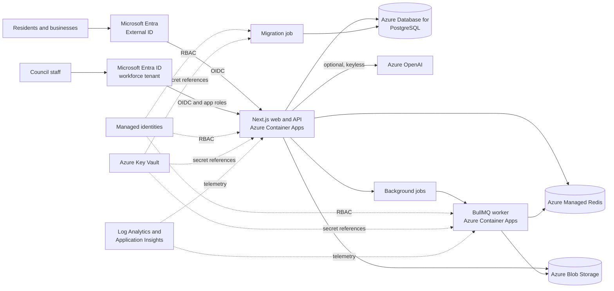

# Digital Permit Platform Solution Accelerator

[](https://github.com/Azure-Samples/Digital-Permit-Platform/actions/workflows/ci.yml)
[](https://github.com/Azure-Samples/Digital-Permit-Platform/actions/workflows/codeql.yml)
[](LICENSE)

A configuration-driven reference implementation for digitising local-authority licences and permits on Microsoft Azure. It provides resident, officer, manager, and administrator experiences in one deployable application, with optional policy-grounded Azure OpenAI capabilities.

> [!IMPORTANT]
> This repository is a solution accelerator, not a finished government service. It defaults to synthetic Contoso data and demo authentication. Before production use, configure the included Microsoft Entra identity paths and complete the payment, notification, antivirus, policy, accessibility, privacy, networking, and operational controls in the [production checklist](docs/security.md#production-checklist).

## Contents

- [Why this accelerator](#why-this-accelerator)
- [What it includes](#what-it-includes)
- [Architecture](#architecture)
- [Deploy to Azure](#deploy-to-azure)
- [Run locally](#run-locally)
- [Demo users](#demo-users)
- [Documentation](#documentation)
- [Security and responsible AI](#security-and-responsible-ai)
- [Project status](#project-status)

## Why this accelerator

Licensing and permit services often grow as separate PDF forms, inboxes, spreadsheets, and line-of-business systems. That fragmentation makes applications hard to track, creates repetitive officer work, and makes policy changes expensive to implement consistently.

The Digital Permit Platform demonstrates a reusable alternative:

- one catalogue for different licence and permit types;
- configuration-driven forms, evidence, fees, workflows, and service levels;
- versioned module definitions so in-flight cases retain their original rules;
- resident self-service and staff case management over the same record;
- an append-only audit trail for material actions;
- optional AI assistance grounded in a seeded licensing policy;
- repeatable Azure deployment through the Azure Developer CLI (`azd`).

## What it includes

| Persona | Sample capabilities |
|---|---|
| Resident or business | Browse services, check requirements, register, save a draft, submit answers and evidence, and track progress |
| Licensing officer | Work queue, case review, documents, checklists, notes, workflow progression, SLA alerts, and decisions |
| Manager | Operational dashboard, assignment, reports, service-level visibility, and policy workspace |
| Administrator | Configure modules, forms, document requirements, workflows, fees, review checklists, versions, and users |
| Policy user | Analyse a synthetic premises licence, ask grounded questions, and review policy citations when AI is enabled |

### Included sample modules

The seed data demonstrates taxis and private hire, alcohol and entertainment, animals, street trading, gambling, scrap metal, skin piercing, and a Blue Badge permit. These are examples only. Each adopting authority must validate its own legal basis, policy wording, forms, fees, retention periods, and decision process.

### Integration status

| Capability | Included implementation | Production action |
|---|---|---|
| Authentication | Microsoft Entra External ID applicant self-service, workforce Entra ID app roles, and explicit demo credentials | Configure both tenants, Conditional Access, MFA, access reviews, support, and audited account-linking operations |
| Payments | Redirect, manual reference, receipt upload, and extension point | Integrate the approved payment provider; do not collect card data in this app |
| Notifications | Queue contract and worker placeholders | Integrate Azure Communication Services or an approved email/SMS service |
| Malware scanning | Queue contract and simulated result | Enable Defender for Storage malware scanning or an approved scanning service |
| AI | Optional Azure OpenAI policy assistant and analyser | Complete use-case evaluation, safety review, DPIA, monitoring, and human-oversight design |
| Policy grounding | In-app PDF/DOCX/text import, parsed preview, version library, controlled activation, source download, and seeded demonstration policy | Upload the approved local policy, review parsed sections, activate it, and validate citation paths |

## Architecture



The deployment creates a virtual network with delegated subnets for Container Apps and PostgreSQL. PostgreSQL has no public endpoint. Container images are pulled from Azure Container Registry with managed identity; Blob Storage and Azure OpenAI use keyless access. Database, Redis, session, demo, OIDC client, and telemetry secrets are referenced from Key Vault.

See [Architecture](docs/architecture.md) for component boundaries, data flows, trust boundaries, and design decisions.

## Deploy to Azure

### Prerequisites

- An Azure subscription.
- Permission to create resources and role assignments, normally **Contributor** plus **User Access Administrator**, or **Owner**, on the target subscription.
- [Azure Developer CLI](https://learn.microsoft.com/azure/developer/azure-developer-cli/install-azd) 1.25 or later.
- [Azure CLI](https://learn.microsoft.com/cli/azure/install-azure-cli) with the Container Apps extension available.
- Docker is optional for Azure remote builds but required for local container validation.
- Azure OpenAI access and model quota only when optional AI is enabled.
- A Microsoft Entra External ID external tenant only when production applicant identity is enabled; the included bootstrap creates its application and user flow.

### Default deployment

AI is disabled by default so the base platform can deploy without model quota.
Authentication defaults to `demo` so the first deployment does not require customer-directory access.

```bash
azd auth login
azd up
```

`azd up` performs these steps:

1. creates stable environment secrets without printing them;
2. provisions the Azure infrastructure with Bicep;
3. remotely builds and deploys the web, worker, and migration images through ACR;
4. runs Prisma migrations in a one-shot Container Apps Job;
5. optionally seeds synthetic demo data.

The command prints the application URL when deployment completes.

### Configure production identity

For a production-intent environment, run one guided command with the external tenant ID or primary domain:

```bash
npm run setup:identity -- --external-tenant <tenant-id-or-domain> --deploy
```

If no environment or deployed URL exists, the command creates/selects the environment and runs `azd provision` to obtain the HTTPS hostname without deploying application images or demo data. It then auto-detects the application name and workforce tenant, creates or reuses both app registrations and service principals, registers local and Azure callbacks, creates and associates an email/password External ID user flow, configures all three workforce app roles, requires workforce assignment, creates bounded client credentials, stores values in `azd` without printing secrets, disables demo access, and runs `azd up`.

Adopters only need to choose the external tenant, approve Azure and directory sign-ins, assign staff users or groups to the generated roles, and apply their MFA, Conditional Access and branding policies. Use `--plan` to preview without changes. See [Identity](docs/identity.md) for permissions and fallback procedures.

### Enable AI

Check model availability and quota in the chosen region before deployment.

```bash
azd env set ENABLE_AI true
azd env set AZURE_OPENAI_LOCATION uksouth
azd env set AZURE_OPENAI_CAPACITY 10
azd up
```

The default model is `gpt-4.1-mini` version `2025-04-14` on Global Standard. Change the Bicep model parameters when that model is unavailable or an organisation has an approved alternative.

### Customise public settings

```bash
azd env set NEXT_PUBLIC_APP_NAME "Example Council Permit Platform"
azd env set NEXT_PUBLIC_SUPPORT_EMAIL "permits@example.gov.uk"
azd env set NEXT_PUBLIC_SUPPORT_PHONE "0300 123 4567"
azd env set SEED_DEMO_DATA false
azd up
```

For quota checks, permissions, deployment outputs, CI/CD, teardown, and failure recovery, follow the complete [deployment guide](docs/deployment.md).
For applicant self-service and staff sign-in, follow the [identity setup guide](docs/identity.md).

## Run locally

### Prerequisites

- Node.js 22 or later
- Docker Desktop or another Docker Compose-compatible runtime

### Start the sample

```bash
cp .env.example .env
npm ci
docker compose up -d
npm run db:generate
npm run db:migrate:deploy
npm run db:seed:all
npm run dev
```

Open:

- application: <http://localhost:3000>
- MailHog email viewer: <http://localhost:8025>

Run the worker in a second terminal when testing background jobs:

```bash
npm run worker
```

See [Local development](docs/local-development.md) for Azure authentication, AI setup, database reset, template generation, and common macOS/Windows notes.

## Demo users

Synthetic users are created only when demo seeding is enabled and can sign in only in `demo` or `hybrid` authentication mode.

| Role | Email |
|---|---|
| Applicant | `applicant@example.com` |
| Reviewer | `reviewer@example.com` |
| Manager | `manager@example.com` |
| Administrator | `admin@example.com` |

Locally, the password is the `DEMO_PASSWORD` value in `.env`. In an `azd` environment, retrieve it locally with:

```bash
azd env get-value DEMO_PASSWORD
```

Treat this value as a secret. Never paste it into issues, pull requests, screenshots, or support tickets.

## Quality checks

```bash
npm run lint
npm run typecheck
npm test
npm run build
npm audit --audit-level=low
```

The repository also validates Bicep, public-release hygiene, Markdown links, containers, and core browser journeys in CI.

## Documentation

| Guide | Purpose |
|---|---|
| [Architecture](docs/architecture.md) | Services, data flows, trust boundaries, and design decisions |
| [Deployment](docs/deployment.md) | `azd`, prerequisites, AI quota, outputs, CI/CD, and cleanup |
| [Local development](docs/local-development.md) | Developer setup, seeds, testing, and troubleshooting |
| [Configuration](docs/configuration.md) | Environment variables and deployment parameters |
| [Identity](docs/identity.md) | External ID user flows, workforce app roles, callbacks, account linking, and validation |
| [Customisation](docs/customization.md) | Branding, modules, identity, payments, notifications, and policy |
| [Security](docs/security.md) | Threat model, controls, known gaps, and production checklist |
| [Responsible AI](docs/responsible-ai.md) | Intended use, limitations, evaluation, oversight, and safety |
| [Operations](docs/operations.md) | Health, logs, alerts, backup, scaling, rotation, and recovery |
| [Cost](docs/cost.md) | Cost drivers, development defaults, and optimisation levers |
| [Troubleshooting](docs/troubleshooting.md) | Common local and Azure deployment failures |
| [Infrastructure](infra/README.md) | Bicep module map and direct infrastructure validation |

## Security and responsible AI

- Do not use real personal, payment, medical, identity, or criminal-record data in the sample environment.
- Uploaded documents and prompts can contain sensitive data. Define retention, access, redaction, logging, and incident-response controls before production use.
- AI output is advisory. A qualified officer remains responsible for evidence review and every statutory decision.
- Report suspected vulnerabilities privately according to [SECURITY.md](SECURITY.md).

## Project status

This accelerator is intended to accelerate discovery and implementation. APIs, schemas, and infrastructure may change. It is not supported under a Microsoft standard support programme; see [SUPPORT.md](SUPPORT.md).

## Contributing

Contributions are welcome. Read [CONTRIBUTING.md](CONTRIBUTING.md), [CODE_OF_CONDUCT.md](CODE_OF_CONDUCT.md), and the [MIT License](LICENSE) before opening a pull request.
