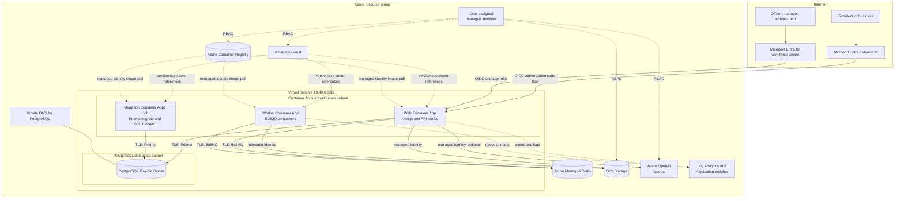
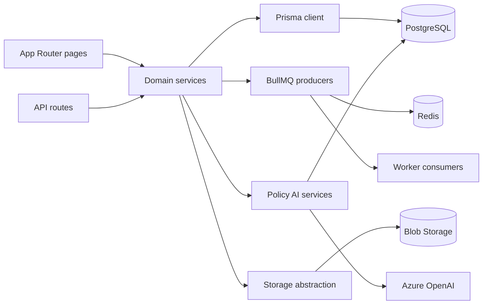
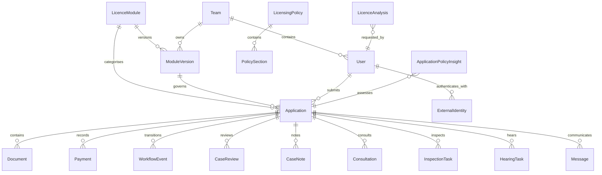

# Architecture

## Purpose

The Digital Permit Platform is a modular reference implementation for licence and permit services. One Next.js application serves public, applicant, officer, manager, and administrator journeys. PostgreSQL stores authoritative data; Redis coordinates background work; Blob Storage stores uploaded evidence; optional Azure OpenAI provides policy-grounded assistance.

The architecture favours a readable single-region starting point over a claim of production completeness. The Bicep defaults are suitable for development and demonstration. The final topology must follow the adopting organisation's availability, network, privacy, security, and recovery requirements.

Editable diagram source: [architecture.excalidraw](architecture.excalidraw). Open it with the public editor at <https://excalidraw.com/>.

## Platform view

## Application view

### Main code boundaries

| Path | Responsibility |
|---|---|
| `src/app` | Pages, layouts, server actions, and API routes |
| `src/components` | Applicant, staff, administrator, AI, form, tour, and shared UI components |
| `src/lib/modules` | Module catalogue and application service layer |
| `src/lib/workflow` | Configuration-driven workflow transitions |
| `src/lib/queue` | Queue producers, TLS connection options, worker entry, and consumers |
| `src/lib/ai` | Azure OpenAI client, prompts, policy context, analysis, and chat orchestration |
| `src/lib/auth` | Entra claim validation, provider configuration, immutable identity linking, and role mapping |
| `src/lib/storage.ts` | Azurite connection strings locally; managed identity and user-delegation SAS in Azure |
| `prisma/schema.prisma` | Authoritative relational model |
| `prisma/migrations` | Ordered database changes |
| `prisma/seed*.ts` | Synthetic modules, policy, applications, and permit data |

## Domain model

The configuration-driven core separates a licence or permit definition from individual applications:

`ModuleVersion` stores JSON definitions for forms, required documents, workflow stages, review checklists, fees, eligibility, notification templates, and retention settings. Publishing a changed definition creates a new version so existing applications continue to reference the rules under which they were submitted.

## Key flows

### Application submission

1. The catalogue loads enabled public modules and their active versions.
2. The applicant selects an application type and creates a draft.
3. The form renderer applies configured conditional rules.
4. Answers are stored as structured JSON against the selected module version.
5. Evidence is stored in Blob Storage or, for selected generated documents, in PostgreSQL.
6. Submission creates the initial workflow event and enqueues applicable work.
7. Staff process the case through the configured stages and record a decision.

### Private document download

1. An authenticated API route authorises access to the document record.
2. The web managed identity requests a Blob user-delegation key.
3. The server creates a short-lived, read-only SAS for one blob.
4. The browser receives the temporary URL. Storage account shared-key access remains disabled.

### Optional policy AI

1. Approved policy text and sections are stored in PostgreSQL.
2. The server builds a bounded policy context for the requested operation.
3. The web managed identity obtains an Azure OpenAI token through `DefaultAzureCredential`.
4. Prompts request structured analysis or a grounded answer with policy references.
5. Results and extracted citations are stored for staff review.
6. A human officer validates evidence, citations, and the final statutory decision.

The current licence analysis starts work in the long-lived web process and the client polls the record. A production deployment that requires guaranteed processing should move this operation to a durable queue or job rather than relying on fire-and-forget server execution.

## Identity and access

End-user identity and Azure workload identity are separate trust planes.

Applicants authenticate through a Microsoft Entra External ID external tenant and its self-service sign-up/sign-in user flow. Staff authenticate through a tenant-scoped workforce app registration. The workforce `roles` claim maps the exact values `Dpp.Reviewer`, `Dpp.Manager`, and `Dpp.Administrator`; tenant membership or email domain alone grants no access.

PostgreSQL links each OIDC account by the immutable `(issuer, subject)` tuple. A duplicate email never triggers automatic account merging. External applicant identities are constrained to `APPLICANT`, while staff roles are synchronized from signed app-role claims at sign-in. See [Identity](identity.md).

Three user-assigned managed identities separate web, worker, and migration Azure responsibilities.

| Identity | Azure permissions |
|---|---|
| Web | ACR pull, Key Vault Secrets User, Storage Blob Data Contributor, Storage Blob Delegator, optional Cognitive Services OpenAI User |
| Worker | ACR pull, Key Vault Secrets User, Storage Blob Data Contributor |
| Migration | ACR pull and Key Vault Secrets User |

JWT application sessions are bounded to eight hours. Demo credential authentication is a separate, explicit server-side mode and is disabled by the `entra` deployment mode. Azure managed identity does not replace end-user identity, and Entra end-user tokens do not grant Azure resource access.

## Network boundaries

The default template uses these boundaries:

- Container Apps runs in a dedicated infrastructure subnet.
- PostgreSQL runs in a delegated subnet with private DNS and public access disabled.
- ACR, Storage, Key Vault, Azure Managed Redis, Application Insights, and optional Azure OpenAI expose public service endpoints in the development profile.
- ACR admin authentication and Storage shared-key authentication are disabled.
- Key Vault, Blob, and OpenAI data access is authorised with RBAC and managed identity.
- Redis uses an access key stored in Key Vault and TLS 1.2 or later.

For production, assess private endpoints for ACR, Storage, Key Vault, Redis, and OpenAI; Container Apps egress control; DNS; firewall policy; private build access; and operator access paths. Turning off a public endpoint without adding the matching private DNS and network path will break the application.

## Availability and recovery

The development defaults are single-region:

- web replicas scale from one to three;
- the worker has one replica;
- PostgreSQL uses a Burstable SKU without zone-redundant HA;
- Storage uses LRS;
- Redis enables service high availability;
- no cross-region traffic manager or replicated application stack is included.

Production design should start from business RTO and RPO, then select PostgreSQL HA and geo-backup, ZRS/GZRS storage, Redis persistence or active geo-replication, deployment-region strategy, and tested restore procedures.

## Design decisions

| Decision | Rationale | Trade-off |
|---|---|---|
| Next.js full-stack application | Shared TypeScript types and one deployment unit | Web and API scaling are coupled |
| PostgreSQL and Prisma | Strong relational integrity with JSON configuration where flexibility is needed | Schema migrations require an explicit job |
| BullMQ and Redis | Familiar delayed-job and retry model | Redis is another stateful service and the sample consumers are placeholders |
| Container Apps | Managed container runtime without AKS operations | Some advanced networking and rollout needs require additional design |
| Key Vault references | Secrets are not copied into Bicep outputs or app configuration values | Identity and vault availability become startup dependencies |
| Separate applicant and workforce tenants | Customer self-service remains isolated from council workforce administration | Two app registrations, policies, credentials, and support paths must be operated |
| Immutable issuer and subject linking | Avoids email-based account takeover and survives contact-address changes | Legitimate collisions require an identity-proofed support workflow |
| Optional Azure OpenAI | Base platform deploys without model access or quota | AI-enabled deployments require separate capacity and evaluation |
| Synthetic seeded policy | Demonstrates grounded behavior end to end | It is not legal guidance and must be replaced |

## Related guidance

- [Security](security.md)
- [Responsible AI](responsible-ai.md)
- [Operations](operations.md)
- [Deployment](deployment.md)
