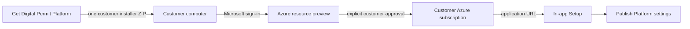

# Customer Azure installer and in-app Setup

Digital Permit Platform has two deliberately separate setup experiences:

1. **Get Digital Permit Platform** is a standalone customer installer, suitable for a dedicated public domain such as `get.digitalpermitplatform.com`. It prepares a customer-owned Azure deployment.
2. **Setup inside the deployed application** controls only the visual identity and support details that residents and staff see.



## Customer journey

The intended answer to "How do we get it?" is:

1. Open the hosted customer installer.
2. Enter the council basics, initial services, Azure region and account model.
3. Review the Azure services, ownership boundary and billing warning.
4. Download one ZIP.
5. Extract it on the deployment owner's computer.
6. On Windows, double-click `Install-DigitalPermitPlatform.cmd`. On macOS, double-click `Install-DigitalPermitPlatform.command`.
7. Complete Microsoft sign-in and MFA in the browser.
8. Select the council subscription, review the Azure preview and approve only when it is correct.
9. Open the application URL printed by the installer.
10. In **Setup**, add the approved landscape logo, colours and content, then publish them.

No source cloning or manually constructed deployment command is needed for this path.

## Why deployment runs locally

The hosted installer never receives Azure credentials, tokens, subscription access or directory consent. The downloaded assistant runs on the customer's computer and uses:

- Azure Developer CLI interactive browser authentication;
- the customer's existing Microsoft Entra MFA and Conditional Access;
- versioned Bicep from this repository;
- `azd provision --preview` before any deployment approval;
- managed identities for Azure-hosted workloads;
- a repeatable `azd` environment for retries and future updates.

This avoids creating a privileged publisher control plane with standing access to many council subscriptions.

## Before starting

The customer needs:

- an active Azure subscription approved for the service;
- **Owner**, or **Contributor plus User Access Administrator**, on the target scope because the deployment creates resources and role assignments;
- for production identity, administrators for the council External ID and workforce tenants;
- an internet/proxy path that permits Microsoft Azure endpoints and package downloads;
- authority to create billable Azure resources.

Azure resources are billed directly to the selected customer subscription. The preview is a prediction and can include ARM what-if noise for server-defaulted properties. The deployment owner must review policy, permissions, quota and expected cost before approval.

## Windows Start file

`Install-DigitalPermitPlatform.cmd` launches `scripts/setup/Install-DigitalPermitPlatform.ps1`. The PowerShell assistant:

1. checks for Node.js 22, Azure Developer CLI 1.25+, and Azure CLI;
2. offers to install missing tools through Windows Package Manager after asking permission;
3. prepares the exact versioned deployment project;
4. validates the secret-free council package and optional logo;
5. opens Microsoft sign-in locally when needed;
6. prepares/selects a resumable `azd` environment;
7. runs the Azure resource preview;
8. asks whether to approve the billable deployment;
9. provisions infrastructure, configures identity when selected, deploys workloads and runs migrations;
10. writes `deployment-result.json` containing non-secret support information and the application URL.

The assistant never asks for an Azure password. If it stops after provisioning starts, rerun the same Start file. Bicep and the selected `azd` environment make the operation repeatable.

macOS and Linux deployment owners can run:

```bash
bash install-digital-permit-platform.sh
```

The `bash` form works even when an archive extractor removes the executable bit. The packaged `.command` and `.sh` files also carry Unix mode `755`. The shell launcher checks prerequisites and uses the same preview, approval and deployment implementation.

## Local administrator rights versus Azure permissions

These are separate permission systems:

- **Running the launcher** does not inherently require local computer administrator rights. Microsoft sign-in, package validation, Azure preview and deployment can run as the signed-in desktop user.
- **Installing missing prerequisites** may require local elevation, depending on operating system, package manager and council device policy. Windows Package Manager can show a UAC prompt. A correctly installed Homebrew setup usually installs packages without `sudo`, but installing Homebrew itself or using a managed Mac may require an administrator or IT deployment.
- **Azure permissions** are always required independently of local administrator status. The deployment owner needs **Owner**, or **Contributor plus User Access Administrator**, on the selected Azure scope because the Bicep deployment creates resources and role assignments.
- **Directory permissions** are separate again. Production identity may require External ID and workforce tenant administrators to approve applications, consent and role assignments.

For locked-down council devices, the recommended operating model is for IT to preinstall Node.js 22, Azure Developer CLI and Azure CLI through the organisation's software-management tooling, then let the nominated Azure deployment owner run the customer installer without permanent local administrator access.

## Hosted installer deployment

Build the public source archive from the validated repository boundary:

```bash
npm run validate:release
npm run setup:installer:package
```

The output is:

```text
dist/digital-permit-platform-installer-source.zip
```

Run or deploy the web application with:

```text
SETUP_INSTALLER_MODE=true
INSTALLER_SOURCE_PATH=/absolute/path/to/digital-permit-platform-installer-source.zip
INSTALLER_SOURCE_URL=/api/installer/source
```

Installer mode restricts the application to `/setup`, the preview endpoint, the source download endpoint and static assets. It does not expose authentication, applicant, staff, admin or profile-apply routes.

The browser combines the validated source archive and generated council package into one download. The package contains no passwords, tokens, client secrets, database URLs or subscription credentials.

## In-app Setup

The deployed application's **Setup** page controls only the live experience for residents and staff:

- council and public service names;
- support email and telephone;
- approved landscape council logo;
- optional adjacent council-name text for symbol-only logos, which can be hidden for a full wordmark;
- accessible header and accent colours with a live preview;
- explicit review and publication.

Logo guidance prefers a passive SVG landscape wordmark. Raster images should target 1200 x 300 pixels, be at least 600 x 150 pixels and remain under 1 MiB. The UI inspects uploaded dimensions and warns about square or undersized assets.

Publication requires an unchecked acknowledgement stating that the changes affect the live citizen and staff service. The API independently rejects requests without the exact acknowledgement, and the audit event records that public impact was confirmed.

Azure resources, region, identity, AI and deployment settings are intentionally absent from the main application. Those changes require the standalone customer installer or the controlled `azd` workflow. Licence and permit availability remains under **Admin > Modules**, rather than being duplicated in Setup.

## Security properties

- Hosted installer has no customer Azure identity.
- Setup ZIPs are schema validated, size bounded and secret free.
- Logos are MIME/signature checked; passive SVG restrictions block active and external content.
- Azure authentication is interactive and local; user passwords are never command-line inputs.
- Runtime Azure access uses managed identity and least-privilege RBAC.
- Bicep is incremental and version controlled.
- Preview and explicit approval occur before deployment.
- Generated secrets are stored in Azure Key Vault and not printed.
- A non-secret deployment receipt supports handoff and troubleshooting.

## Microsoft references

- [Install Azure Developer CLI](https://learn.microsoft.com/azure/developer/azure-developer-cli/install-azd)
- [Azure Developer CLI authentication](https://learn.microsoft.com/azure/developer/azure-developer-cli/reference#azd-auth-login)
- [Bicep what-if preview](https://learn.microsoft.com/azure/azure-resource-manager/bicep/deploy-what-if)
- [Install Azure CLI on Windows](https://learn.microsoft.com/cli/azure/install-azure-cli-windows)
